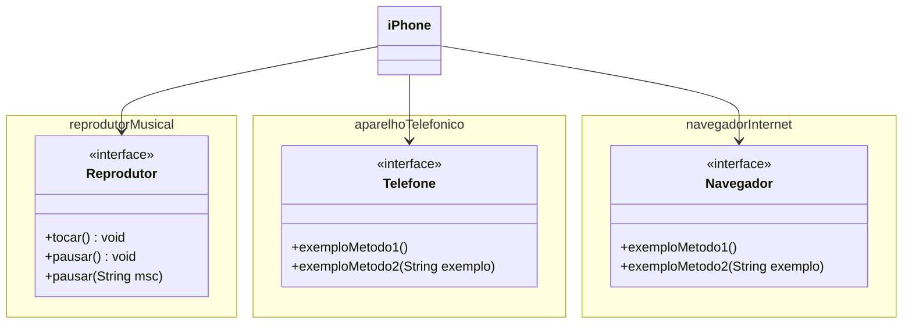

## Projeto UML (Mermaid)

Feito projeto UML como solicitado e Código em Java implementando o projeto.

```mermaid
classDiagram
namespace reprodutorMusical{
    class Reprodutor {
        +tocar()void
        +pausar()void
        +pausar(String msc)
    }
}

namespace aparelhoTelefonico{
    class Telefone {
        +exemploMetodo1()
        +exemploMetodo2(String exemplo)
    }
}

namespace navegadorInternet{
    class Navegador {
        +exemploMetodo1()
        +exemploMetodo2(String exemplo)
    }
}

    <<interface>> Reprodutor
    <<interface>> Telefone
    <<interface>> Navegador

    class iPhone {
    }

    iPhone --> Reprodutor
    iPhone --> Telefone
    iPhone --> Navegador
```
